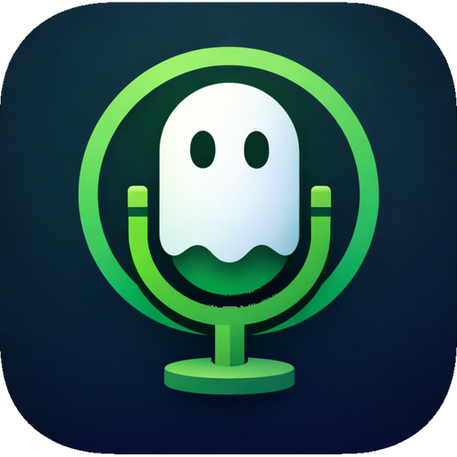

  

# Kolboo

Accurate speech-to-text using advanced STT models like Whisper (local or via API).

This is a fork of [Tambourine](https://github.com/kstonekuan/tambourine-voice) mainly created as an alternative which does not require a standalone python server (but ended up with loads more features on top of that).

|||
|-|-|
|Home|Settings|
|||
|Stats (WIP)|Logs|
|||
u
## Features

- Dictate using state-of-the-art speech-to-text and language models.
- Hotkeys for: Toggle recording, Hold to record, Paste last transcription.
- Pass dictation to LLMs for further enhancement.
- Create per program workflows using the profile system.
- Clean overlay while transcribing ([image](https://github.com/user-attachments/assets/73cbdadd-a347-4bde-b473-8e974dac7eff)) with customizable sound cue.
- Comprehensive provider and model support ([full list](docs/User Docs/SUPPORTED_PROVIDERS_AND_MODELS.md)): Local, Google, OpenAI, Groq, Avalon and more.
- Logging and testing system to easily troubleshoot issues and work on prompts.
- Stats page to track cost usage and more (WIP).
- Audio refinement settings.
- Customize accent color.
- And more.

## Installation

Download Windows installer from the [latest release](https://github.com/DovieW/kolboo/releases).

| Platform | Compatibility    |
| -------- | -------------    |
| Windows  | ✅               |
| macOS    | ⚠️ (need tester) |
| Linux    | ⚠️ (need tester) |

## License

[AGPL-3.0](LICENSE)
