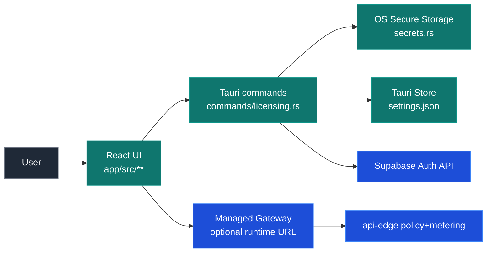
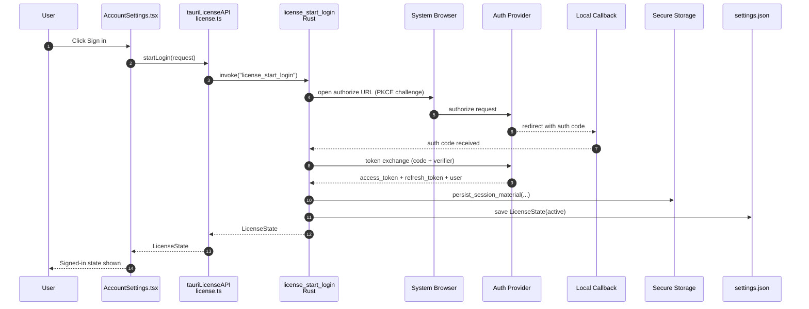
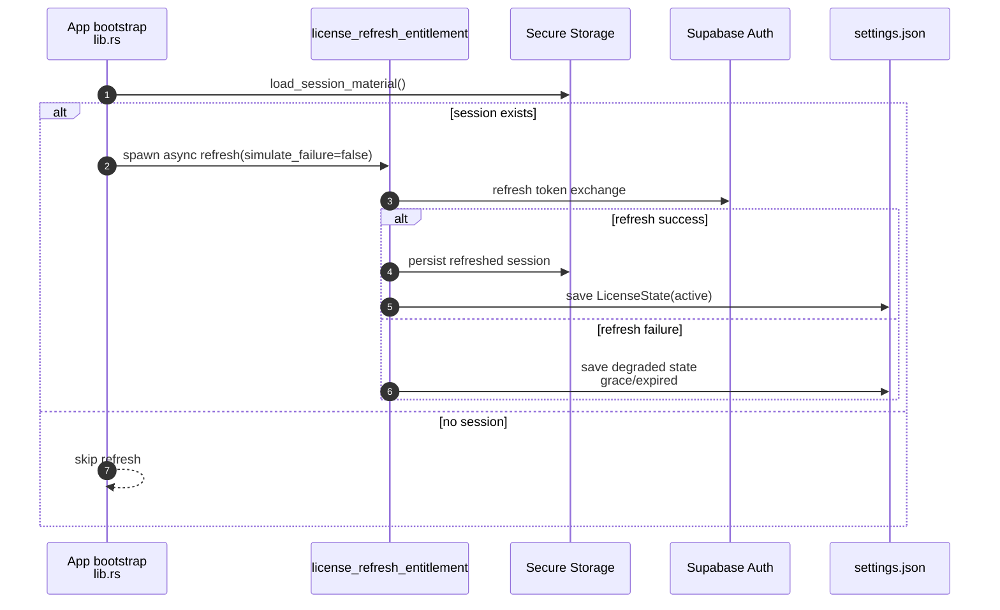
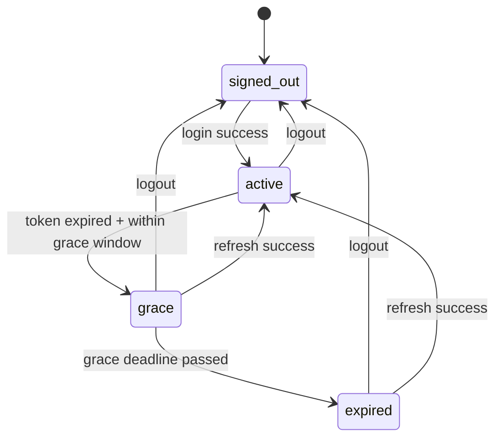
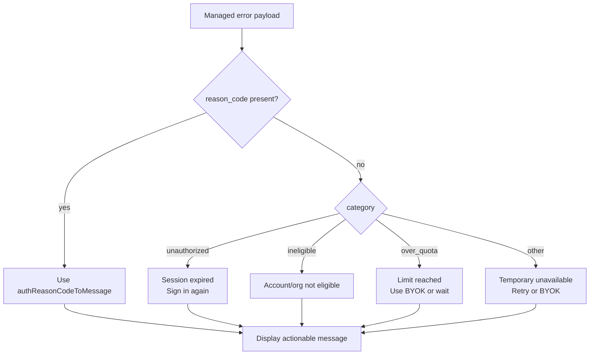

# Authentication Architecture (Desktop + Edge)

This doc explains the target authentication architecture in Kolboo, where the trust boundaries are, and how state moves through the app.

> Scope: end-state behavior for `app/**` (Tauri desktop + React UI) and edge-enforced policy.

## TL;DR

- Identity/session lifecycle is desktop-owned in Tauri (`app/src-tauri/src/commands/licensing.rs`).
- Session secrets are stored in OS secure storage (`app/src-tauri/src/secrets.rs` via licensing helpers).
- UI reads auth state via typed command wrappers in `app/src/lib/tauri/license.ts`.
- Managed request deny outcomes are mapped to user-facing guidance in `app/src/lib/queries.ts`.
- Sign-in uses browser-based Authorization Code + PKCE (loopback callback) with desktop-owned session persistence.

## Trust boundaries

## Core data objects

- **`LicenseState`** (persisted in `settings.json`)
  - tier, status, email/user/org snapshot, usage+limits, timestamps
- **`SessionMaterial`** (secure storage only)
  - access token, refresh token
- **`LicenseAuthContext`** (computed command response)
  - authenticated boolean, `secure_session_present`, policy status, reason code, subject/org context

## Login + session persistence flow

## Startup refresh flow

On app startup, backend does a best-effort silent refresh if secure session material exists.

## License status state machine

## Managed request error mapping (UI behavior)

`toManagedInferenceMessage(...)` in `app/src/lib/queries.ts` resolves the user message in this order:

1. If explicit `reason_code` exists, show reason-specific guidance first.
2. Else map by coarse category (`unauthorized`, `ineligible`, `over_quota`, fallback).

## Auth context command and why it exists

`license_get_auth_context` gives the UI a normalized, backend-owned snapshot:

- `authenticated`
- `secure_session_present`
- `policy_status` (`allow`/`deny`)
- `reason_code` (`reauth_required`, `token_invalid`, etc.)

This keeps frontend logic thin and avoids duplicating auth-state derivation in React.

## Runtime environment knobs

- `TAURI_SUPABASE_URL`
- `TAURI_SUPABASE_PUBLISHABLE_KEY`
- `TAURI_AUTH_PROVIDER` (required browser provider, e.g. `google`)
- `TAURI_AUTH_ISSUER` (optional issuer hint for auth context)

If Supabase vars are missing, auth commands return `auth_not_configured`.

## File map

- Backend auth commands: `app/src-tauri/src/commands/licensing.rs`
- Backend auth types/helpers: `app/src-tauri/src/licensing.rs`
- Secure secrets: `app/src-tauri/src/secrets.rs`
- Startup refresh trigger: `app/src-tauri/src/lib.rs`
- Frontend wrappers: `app/src/lib/tauri/license.ts`
- Frontend command surface: `app/src/lib/tauri/commands.ts`
- UI account page: `app/src/components/settings/AccountSettings.tsx`
- Error-to-message mapping: `app/src/lib/queries.ts`
