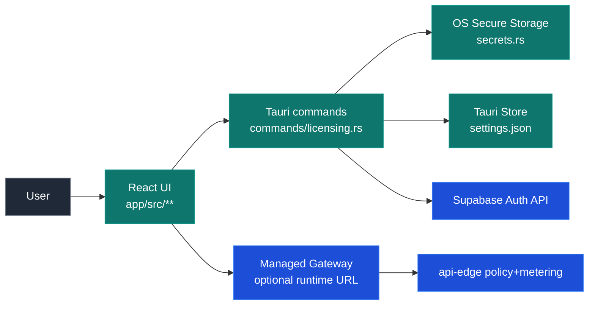
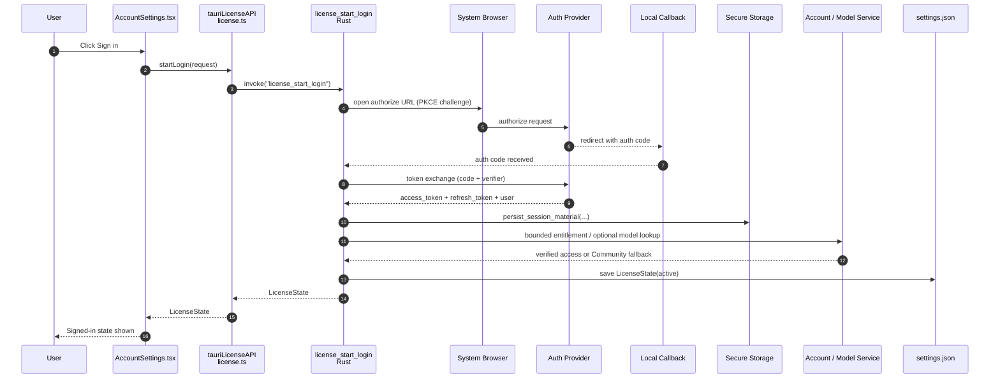
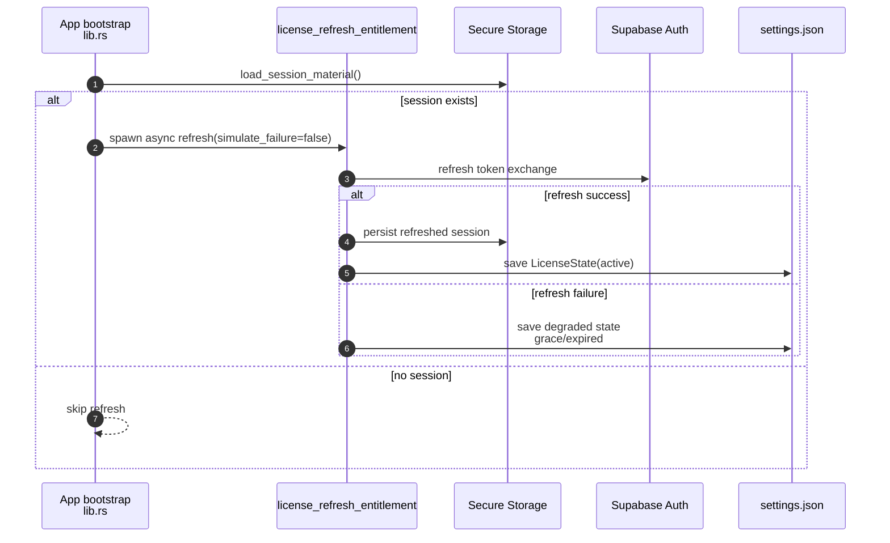
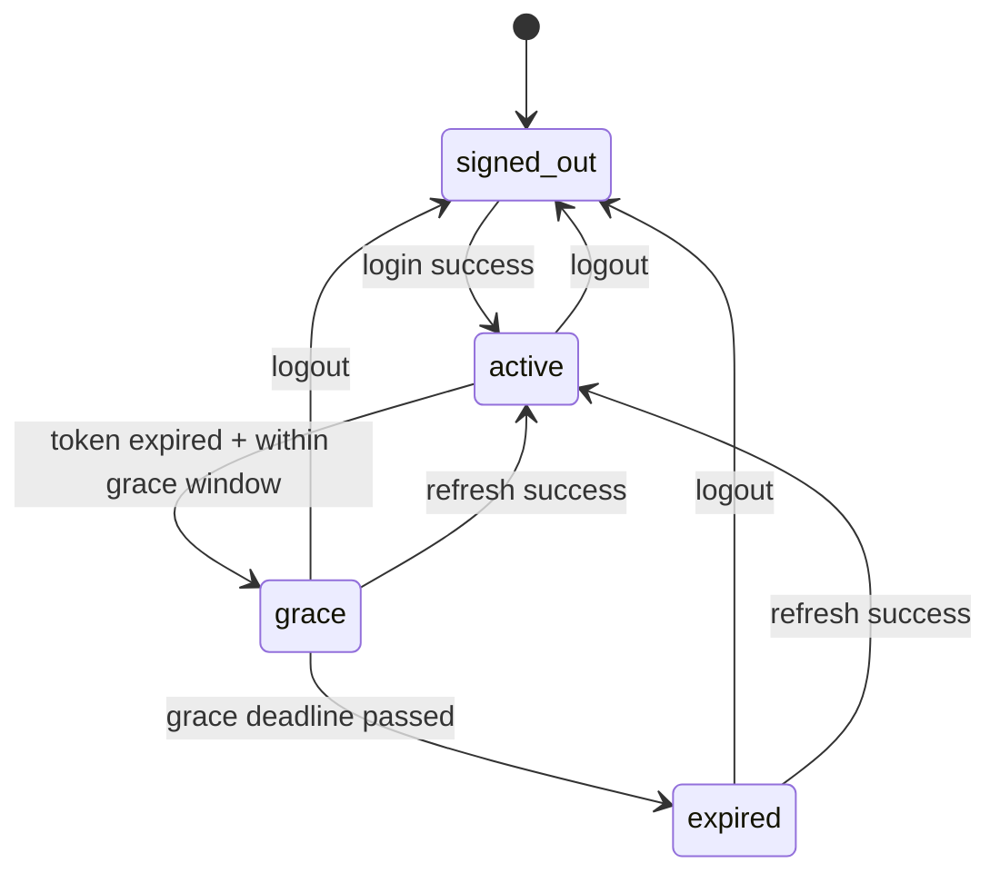
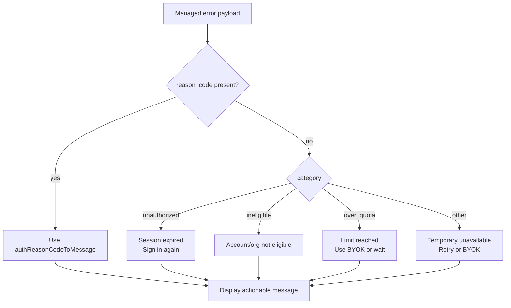

# Authentication Architecture (Desktop + Edge)

This doc explains the target authentication architecture in Kolboo, where the trust boundaries are, and how state moves through the app.

> Scope: end-state behavior for `app/**` (Tauri desktop + React UI) and edge-enforced policy.

## TL;DR

- Identity/session lifecycle is desktop-owned in Tauri (`app/src-tauri/src/commands/licensing.rs`).
- Session secrets are stored in OS secure storage (`app/src-tauri/src/secrets.rs` via licensing helpers).
- UI reads auth state via typed command wrappers in `app/src/lib/tauri/license.ts`.
- Managed request deny outcomes are mapped to user-facing guidance in `app/src/lib/queries.ts`.
- Primary sign-in uses a six-digit email code. Existing password sign-in and
  browser Authorization Code + PKCE / hosted-page handoff remain available.
- Community/BYOK needs no account. Pro beta access is granted by an operator to
  an approved email, not by client metadata or an invite code.

## 0.3.2 desktop release and deferred service rollout

The maintainer chose to ship 0.3.2 as Community/BYOK only, including the Windows
startup fix, and finish the backend afterward. All three packaging workflows set
`TAURI_CLOUD_ENV=community` and `VITE_CLOUD_SERVICE_ENABLED=false`. The build
rejects inherited account-service endpoints/keys. Account signup, managed model
selection and cloud sync are unavailable even if an older Pro session is cached;
the session is preserved unless the user explicitly signs out. First-run setup
goes directly to BYOK. Sentry and disclosed product analytics are unchanged.

The service implementation below is staged for a later service-enabled update.
Backend deployment alone cannot enable signup in the cloud-free 0.3.2 installer.

Implementation checkpoint, October 6: these changes are in progress, not a
service-ready release. Private workspace lint/type/tests/build/contracts and
offline SQL assertions passed, including real concurrent quota/idempotency
requests. Desktop validation passed 925 frontend tests, 977 ordinary Rust tests,
isolated Linux account/window checks and production startup. Patch coverage is
100% of 784 changed executable lines; the only new exclusions are the two
explicitly approved counterless email-command metadata annotations, not bodies.
Final package/platform acceptance remains pending; the live service rollout is
deferred. Those service implementation checks do not constitute live acceptance.

The desktop requests `/auth/v1/otp` with `create_user: true`, then verifies
`/auth/v1/verify` with `type: email`. Supabase must have the approved-email
before-user-created hook and an email template that displays the six-digit code.
This repository does not activate that hook or provision SMTP by building the app.
The UI keeps codes/passwords in memory, provides a resend cooldown and browser
fallback, and cancels outstanding sign-in ownership on exit. Backend cancellation
invalidates late responses; refreshes serialize session rotation. Logout cannot
be undone by an older login or refresh completing afterward.

Authentication success and entitlement lookup are distinct. If the account
service is unavailable after successful authentication, the desktop preserves the
secure session and presents signed-in Community access, not unverified Pro. A
later Refresh access can hydrate approval. Pro's wire tier remains `personal`;
the display label is Pro. Complimentary access has no checkout, invoice or
payment dependency. Revocation and quotas are enforced by the gateway/database,
even if a desktop has cached offline-access state.

The authenticated token pair is committed under session ownership **before**
entitlement hydration or first-install model discovery. Each optional lookup has
a 20-second request/body deadline. An interrupted lookup leaves secure material
available to startup refresh without consuming another email code; it does not
emit an intermediate signed-in cache transition. A logout during either lookup
clears those tokens and invalidates its final cache/settings commit.

First-install settings carry an explicit pending marker, established before
default seeding. Verified active Pro access can select only published managed
transcription defaults (and an available published rewriting default). Existing
provider/model choices, explicit null choices and saved provider keys are not
overwritten. Rewriting is never enabled by sign-in. Failed catalog/setup attempts
remain retryable; failed persistence restores the previous choices. Button or
profile edits relinquish first-install ownership.

Saved custom-provider keys have the same ownership protection as built-ins.
Unreadable wallet entries prevent automatic model replacement rather than being
treated as missing. A failed refresh-token write attempts to restore the prior
access token, so a failed sign-in/rotation does not erase a working token pair.

Account allowances show audio hours, LLM tokens, daily managed requests and UTC
reset boundaries. The Costs tab contains device-local provider estimates, clearly
labelled **not a bill**. Cross-device estimated provider costs are not currently
available; server usage reporting must not invent them. Audio, transcripts,
prompts, provider responses and credentials are excluded from the usage ledger.

## Trust boundaries

```mermaid
flowchart LR
	U[User] --> UI[React UI<br/>app/src/**]
	UI --> TAURI[Tauri commands<br/>commands/licensing.rs]
	TAURI --> SECURE[OS Secure Storage<br/>secrets.rs]
	TAURI --> STORE[Tauri Store<br/>settings.json]
	TAURI --> SB[Supabase Auth API]
	UI --> MG[Managed Gateway<br/>optional runtime URL]
	MG --> EDGE[api-edge policy+metering]

	classDef trust fill:#1f2937,color:#fff,stroke:#6b7280
	classDef local fill:#0f766e,color:#fff,stroke:#0d9488
	classDef cloud fill:#1d4ed8,color:#fff,stroke:#3b82f6

	class U trust
	class UI,TAURI,SECURE,STORE local
	class SB,MG,EDGE cloud
```

## Core data objects

- **`LicenseState`** (persisted in `settings.json`)
  - tier, status, email/user/org snapshot, usage+limits, timestamps
- **`SessionMaterial`** (secure storage only)
  - access token, refresh token
- **`LicenseAuthContext`** (computed command response)
  - authenticated boolean, `secure_session_present`, policy status, reason code, subject/org context

## Login + session persistence flow

```mermaid
sequenceDiagram
	autonumber
	participant User
	participant UI as AccountSettings.tsx
	participant API as tauriLicenseAPI<br/>license.ts
	participant Cmd as license_start_login<br/>Rust
	participant Browser as System Browser
	participant IdP as Auth Provider
	participant Loopback as Local Callback
	participant Sec as Secure Storage
	participant Service as Account / Model Service
	participant Store as settings.json

	User->>UI: Click Sign in
	UI->>API: startLogin(request)
	API->>Cmd: invoke("license_start_login")
	Cmd->>Browser: open authorize URL (PKCE challenge)
	Browser->>IdP: authorize request
	IdP-->>Loopback: redirect with auth code
	Loopback-->>Cmd: auth code received
	Cmd->>IdP: token exchange (code + verifier)
	IdP-->>Cmd: access_token + refresh_token + user
	Cmd->>Sec: persist_session_material(...)
	Cmd->>Service: bounded entitlement / optional model lookup
	Service-->>Cmd: verified access or Community fallback
	Cmd->>Store: save LicenseState(active)
	Cmd-->>API: LicenseState
	API-->>UI: LicenseState
	UI-->>User: Signed-in state shown
```

## Startup refresh flow

On app startup, backend does a best-effort silent refresh if secure session material exists.

```mermaid
sequenceDiagram
	autonumber
	participant Boot as App bootstrap<br/>lib.rs
	participant Cmd as license_refresh_entitlement
	participant Sec as Secure Storage
	participant Supa as Supabase Auth
	participant Store as settings.json

	Boot->>Sec: load_session_material()
	alt session exists
		Boot->>Cmd: spawn async refresh(simulate_failure=false)
		Cmd->>Supa: refresh token exchange
		alt refresh success
			Cmd->>Sec: persist refreshed session
			Cmd->>Store: save LicenseState(active)
		else refresh failure
			Cmd->>Store: save degraded state<br/>grace/expired
		end
	else no session
		Boot-->>Boot: skip refresh
	end
```

## License status state machine

```mermaid
stateDiagram-v2
	[*] --> signed_out
	signed_out --> active: login success
	active --> grace: token expired + within grace window
	grace --> expired: grace deadline passed
	active --> signed_out: logout
	grace --> signed_out: logout
	expired --> signed_out: logout
	grace --> active: refresh success
	expired --> active: refresh success
```

## Managed request error mapping (UI behavior)

`toManagedInferenceMessage(...)` in `app/src/lib/queries.ts` resolves the user message in this order:

1. If explicit `reason_code` exists, show reason-specific guidance first.
2. Else map by coarse category (`unauthorized`, `ineligible`, `over_quota`, fallback).

```mermaid
flowchart TD
	E[Managed error payload] --> RC{reason_code present?}
	RC -->|yes| MSG1[Use authReasonCodeToMessage]
	RC -->|no| CAT{category}
	CAT -->|unauthorized| M1[Session expired<br/>Sign in again]
	CAT -->|ineligible| M2[Account/org not eligible]
	CAT -->|over_quota| M3[Limit reached<br/>Use BYOK or wait]
	CAT -->|other| M4[Temporary unavailable<br/>Retry or BYOK]
	MSG1 --> OUT[Display actionable message]
	M1 --> OUT
	M2 --> OUT
	M3 --> OUT
	M4 --> OUT
```

## Auth context command and why it exists

`license_get_auth_context` gives the UI a normalized, backend-owned snapshot:

- `authenticated`
- `secure_session_present`
- `policy_status` (`allow`/`deny`)
- `reason_code` (`reauth_required`, `token_invalid`, etc.)

This keeps frontend logic thin and avoids duplicating auth-state derivation in React.

## Public build configuration

Release builds embed these public GitHub Actions variables. They must not depend
on the install directory, a developer `.env` file or shell endpoint overrides:

| Actions variable | Embedded setting |
| --- | --- |
| `KOLBOO_PROD_API_BASE_URL` | `TAURI_API_BASE_URL` |
| `KOLBOO_PROD_MANAGED_INFERENCE_GATEWAY_URL` | `TAURI_MANAGED_INFERENCE_GATEWAY_URL` |
| `KOLBOO_PROD_SUPABASE_URL` | `TAURI_SUPABASE_URL` |
| `KOLBOO_PROD_SUPABASE_PUBLISHABLE_KEY` | `TAURI_SUPABASE_PUBLISHABLE_KEY` |
| `KOLBOO_PROD_PUBLIC_AUTH_PAGE_URL` | `TAURI_PUBLIC_AUTH_PAGE_URL` |

Service-enabled packages require `TAURI_CLOUD_ENV=production`,
`VITE_CLOUD_SERVICE_ENABLED=true` and valid HTTPS production origins in
release preflight/build validation. Only a publishable/legacy anon Supabase key is
accepted, never a service-role/secret key. Development-only Cloudflare Access
headers are not attached in release builds. The explicit internal offline-build
bypass is for local diagnostics, not service-ready publication.

Debug builds can override public settings from the local environment. Existing
development browser hints are:

- `TAURI_SUPABASE_URL`
- `TAURI_SUPABASE_PUBLISHABLE_KEY`
- `TAURI_AUTH_PROVIDER` (required browser provider, e.g. `google`)
- `TAURI_AUTH_ISSUER` (optional issuer hint for auth context)

If Supabase vars are missing, auth commands return `auth_not_configured`.

## File map

- Backend auth commands: `app/src-tauri/src/commands/licensing.rs`
- Backend auth types/helpers: `app/src-tauri/src/licensing.rs`
- Secure secrets: `app/src-tauri/src/secrets.rs`
- Startup refresh trigger: `app/src-tauri/src/lib.rs`
- Frontend wrappers: `app/src/lib/tauri/license.ts`
- Frontend command surface: `app/src/lib/tauri/commands.ts`
- UI account page: `app/src/components/account/AccountView.tsx`
- Email-code form: `app/src/components/account/EmailCodeSignIn.tsx`
- Error-to-message mapping: `app/src/lib/queries/shared.ts`
